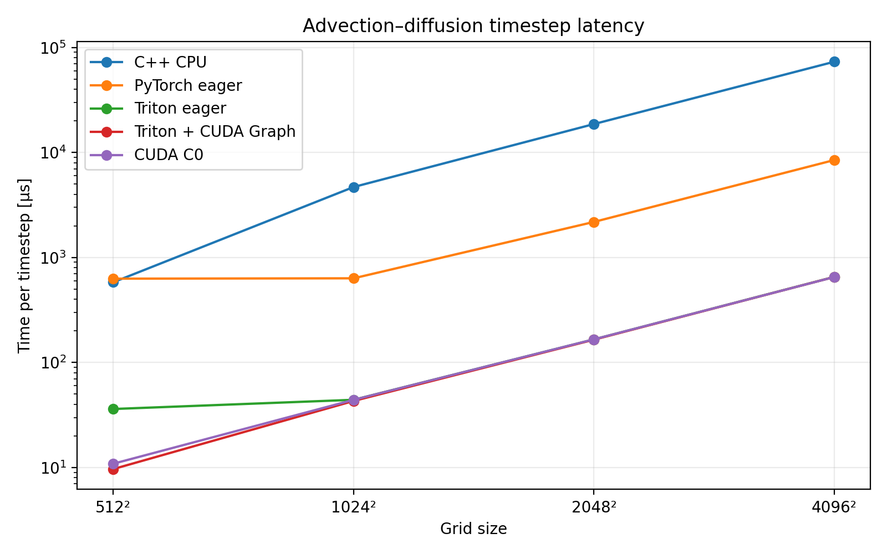
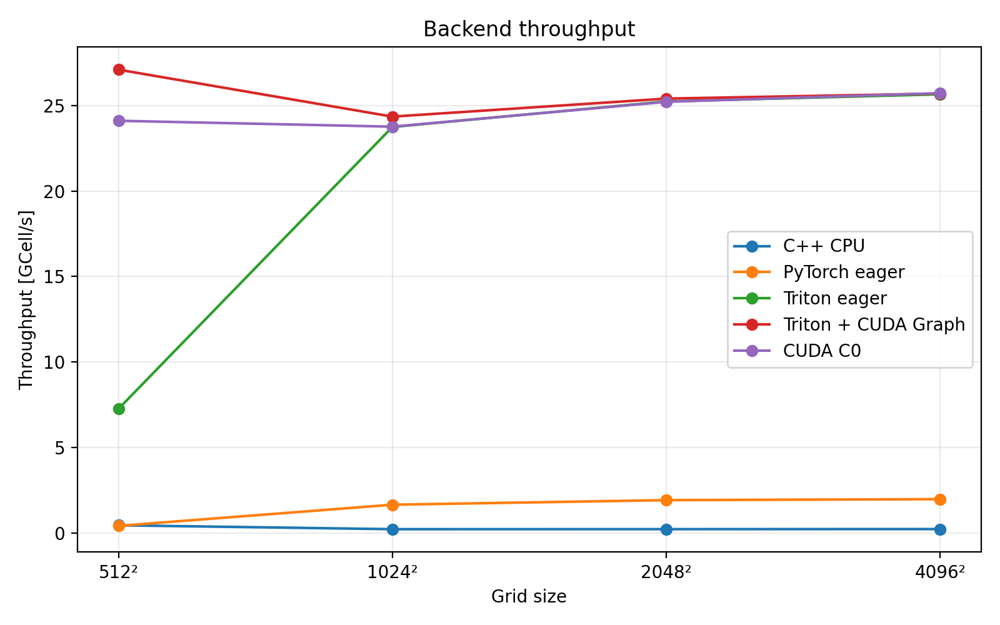
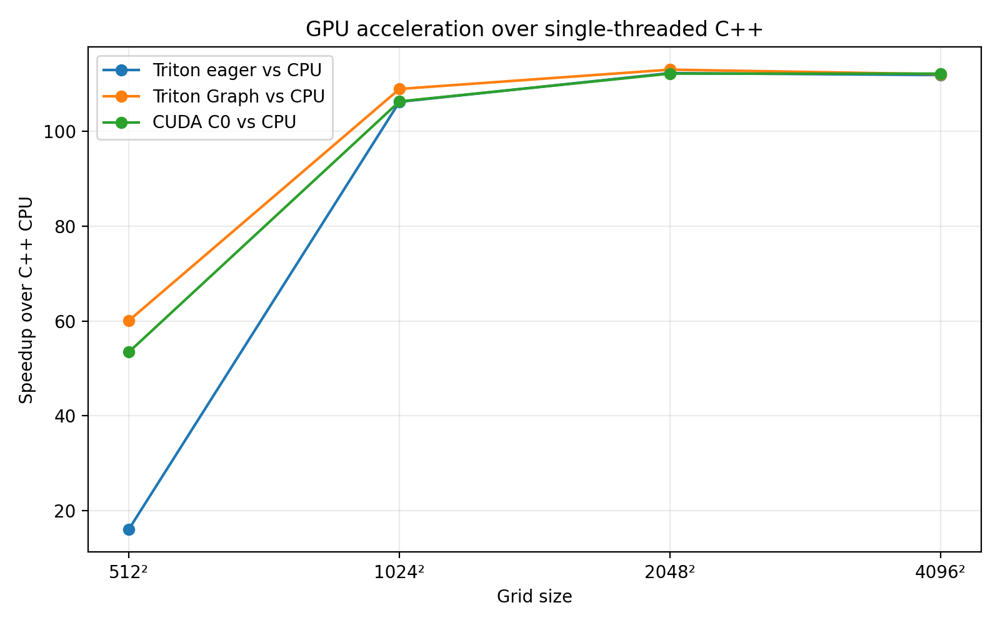
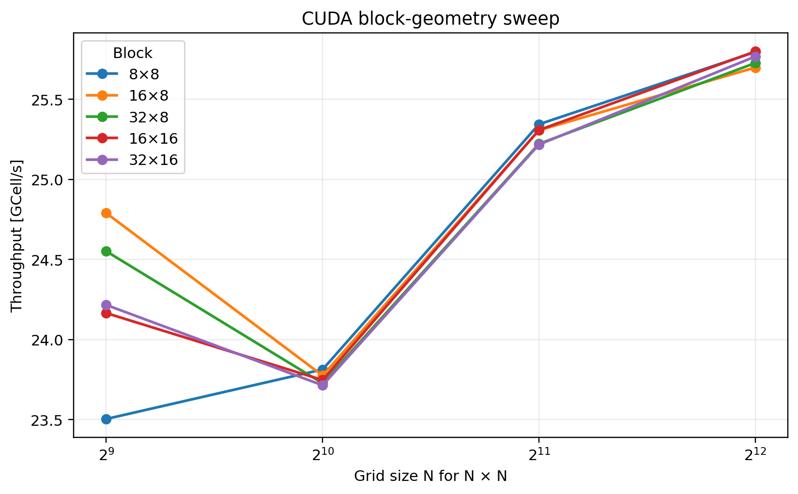
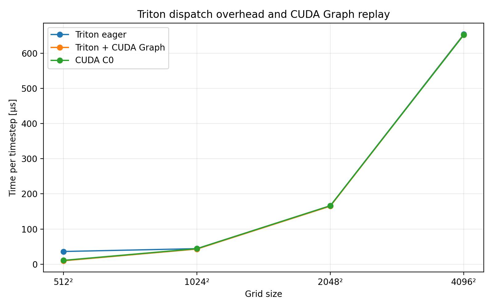

# GPU Advection–Diffusion — CUDA & Triton Optimization Study

GPU optimization study of a real **2-D advection–diffusion finite-difference stencil** extracted from a validated C++ reactive-flow solver.

The project compares:

* NumPy,
* optimized single-threaded C++,
* PyTorch eager,
* hand-written CUDA C++,
* Triton,
* and Triton execution through CUDA Graphs.

The objective is to identify where performance is lost, distinguish kernel efficiency from host-side overhead and evaluate which GPU optimizations actually improve the stencil.

---

## Key findings

* The hand-written CUDA FP64 stencil reaches approximately 25–26 GCell/s on an NVIDIA Tesla V100-SXM2.
* For large grids, the Triton kernel reaches essentially the same throughput as the hand-written CUDA kernel.
* At `512²`, eager Triton is limited primarily by host-side launch and dispatch overhead rather than GPU computation:

  * intrinsic Triton kernel: approximately 10.2 µs,
  * eager iterative timestep: approximately 36.1 µs.
* Capturing 100 fixed-shape timesteps in a CUDA Graph reduces the amortized Triton cost at `512²` to 9.67 µs/timestep, corresponding to a 3.73× speedup over eager Triton execution.
* CUDA thread-block tuning produces only small differences for sufficiently large grids.
* Explicit shared-memory tiling does not improve this stencil on V100: halo loading and synchronization overhead outweigh the benefit of manually managed data reuse.
* Numerical correctness was validated before performance optimization, including irregular grids and integrations up to 1000 timesteps.

---

## Numerical problem

The benchmark solves the two-dimensional advection–diffusion equation

$$ \frac{\partial \phi}{\partial t} + u\frac{\partial \phi}{\partial x} + v\frac{\partial \phi}{\partial y} = D\nabla^2\phi,$$

where:

* $\phi(x,y,t)$ is the transported scalar,
* $u(x,y)$ and $v(x,y)$ are prescribed velocity components,
* $D$ is the diffusion coefficient.

The interior update is based on centered finite differences:

$$ \phi_{i,j}^{n+1} = \phi_{i,j}^{n} - \Delta t \left[ u_{i,j} \frac{\phi_{i+1,j}^{n}-\phi_{i-1,j}^{n}}{2\Delta x} +
v_{i,j} \frac{\phi_{i,j+1}^{n}-\phi_{i,j-1}^{n}}{2\Delta y} \right] + D\Delta t \left[ \frac{ \phi_{i+1,j}^{n} -
2\phi_{i,j}^{n} + \phi_{i-1,j}^{n}}{\Delta x^2} + \frac{\phi_{i,j+1}^{n}-2\phi_{i,j}^{n}+\phi_{i,j-1}^{n}}{\Delta y^2}\right].$$

The implementation contract is identical across backends:

* independent `Nx` and `Ny`,
* independent `dx` and `dy`,
* FP64 arithmetic for the main study,
* flattened row-major storage,
* x-index contiguous in memory,
* separate old and new state arrays,
* ping-pong time integration,
* no in-place stencil update,
* boundary values preserved exactly.

The stencil was extracted from a validated reactive-flow solver rather than designed solely as a synthetic GPU benchmark.

---

## Implementations

| Backend       | Role                                                    |
| ------------- | ------------------------------------------------------- |
| NumPy         | Numerical reference                                     |
| C++ CPU       | Optimized single-threaded CPU baseline                  |
| PyTorch eager | High-level GPU tensor baseline                          |
| CUDA C0       | Fused global-memory CUDA kernel                         |
| CUDA C1       | CUDA block-size tuning study                            |
| CUDA C2       | Explicit shared-memory tiling experiment                |
| Triton T0     | Baseline fused Triton kernel                            |
| Triton T1     | `BLOCK_SIZE` / `num_warps` tuning                       |
| Triton T2     | CUDA Graph replay to reduce host-side dispatch overhead |

---

## Numerical validation

Correctness was established before performance optimization.

### CUDA

The CUDA implementation was compared against the NumPy reference on multiple cases, including:

* constant fields,
* diffusion-only problems,
* advection-only problems,
* combined advection–diffusion,
* anisotropic grids,
* irregular grid sizes,
* random initial conditions,
* long integrations up to 1000 timesteps.

Representative errors remained at or near FP64 machine precision.

The global-memory C0 and explicit shared-memory C2 kernels were also compared directly on an irregular `37 × 51` grid for:

* 1 timestep,
* 10 timesteps,
* 1000 timesteps.

They produced identical numerical results.

### Triton

The final FP64 Triton implementation was validated against the numerical reference.

After explicitly typing runtime scalar coefficients as `tl.float64`:

* 1 timestep: exact agreement,
* 10 timesteps: $L_\infty \approx 1.39\times10^{-17}$,
* 1000 timesteps: $L_\infty \approx 1.11\times10^{-16}$.

### CUDA Graph replay

CUDA Graph execution was compared directly against eager Triton for 1000 timesteps.

Results were bitwise identical for:

* `37 × 51`,
* `512 × 512`.

For both validation cases:

```text
rel_L2 = 0
Linf   = 0
```

---

# Performance results

GPU timings reported below exclude:

* initialization,
* GPU allocation when appropriate,
* host-device transfers,
* file I/O.

Fields remain resident on the GPU throughout the timed iterative computation.

The main GPU measurements were performed on:

```text
NVIDIA Tesla V100-SXM2-16GB
Compute capability 7.0
FP64
```

---

## Backend comparison



The optimized single-threaded C++ implementation provides the CPU reference baseline.

PyTorch eager evaluates the stencil through multiple tensor operations, while CUDA C0 and Triton T1 fuse the complete stencil update into a single GPU kernel per timestep.

For large grids, both the hand-written CUDA kernel and the Triton kernel sustain approximately **25–26 GCell/s** on the tested V100.





For the largest tested grids, the custom GPU implementations provide roughly two orders of magnitude acceleration over the optimized single-threaded CPU baseline.

---

# CUDA optimization study

## C0 — global-memory baseline

The first CUDA implementation uses:

* one CUDA thread per grid cell,
* flattened storage,
* x-direction contiguous memory accesses,
* global-memory stencil reads,
* one fused kernel per timestep,
* separate old/new device buffers,
* ping-pong execution.

The retained launch configuration is:

```text
blockDim = (32, 8)
threads/block = 256
```

For sufficiently large grids, C0 reaches approximately:

```text
25–26 GCell/s
```

on the V100.

---

## C1 — block-size tuning

Several CUDA launch configurations were evaluated:

```text
8 × 8
16 × 8
32 × 8
16 × 16
32 × 16
```

Measurements were performed using an order-balanced cyclic benchmark to reduce thermal, frequency and ordering bias.

For large grids, the differences between configurations remained below approximately one percent.

The original

```text
32 × 8
```

configuration was therefore retained because it:

* maps warps naturally onto contiguous x-direction accesses,
* provides robust performance,
* avoids introducing unnecessary configuration complexity.



---

## C2 — explicit shared-memory tiling

A second CUDA implementation explicitly stages the scalar field in shared memory.

For a `32 × 8` block, the shared-memory tile contains:

```text
(32 + 2) × (8 + 2)
= 34 × 10
= 340 doubles
```

corresponding to:

```text
2720 bytes
≈ 2.66 KiB per block
```

The tile includes a one-cell halo around the block.

C2 was validated against C0 and produced identical results.

However, C2 was consistently slower:

* approximately 1–2% slower on large grids in the alternating benchmark,
* approximately 2.8% higher kernel latency in the same-node Nsight comparison at `4096²`.

Nsight also showed:

```text
C0: 30 registers/thread
C2: 28 registers/thread
```

so the slowdown cannot be attributed simply to increased register pressure.

The explicit shared-memory implementation introduces:

* cooperative halo loading,
* additional indexing,
* a block-wide synchronization barrier.

For this stencil on V100, these costs outweigh the benefit of explicit shared-memory reuse.

The result is consistent with the hardware cache hierarchy already exploiting much of the spatial reuse present in the stencil.

C2 is therefore retained as a documented **negative optimization experiment**, while C0 remains the final CUDA implementation.

---

# Triton optimization study

The tested environment uses:

```text
PyTorch 2.8.0
Triton 3.4.0
CUDA 12.8 runtime through the PyTorch environment
NVIDIA Tesla V100-SXM2-16GB
Compute capability 7.0
```

A Triton smoke test successfully compiled and executed on the Jean Zay V100 environment.

---

## T0 — baseline Triton kernel

T0 maps each Triton program to a contiguous one-dimensional block of flattened grid indices.

Each program computes:

* center value,
* left/right neighbors,
* top/bottom neighbors,
* local velocity values,
* centered advection,
* centered diffusion,
* final explicit time update.

The complete stencil remains fused into a single kernel.

The initial implementation exposed an important precision detail: runtime Python floating-point coefficients had to be explicitly typed as

```python
tl.float64
```

to maintain FP64 consistency with the state arrays.

After this correction, the Triton implementation reproduced the reference solution to machine precision.

---

## T1 — Triton launch tuning

The following `(BLOCK_SIZE, num_warps)` configurations were tested:

```text
64   / 2
128  / 4
256  / 4
256  / 8
512  / 4
512  / 8
1024 / 8
```

The final retained configuration is:

```text
BLOCK_SIZE = 256
num_warps  = 8
```

It provides the best overall behavior across the tested grid sizes.

For large grids, its performance is essentially identical to CUDA C0.

Representative same-GPU results are:

|    Grid |    CUDA C0 | Triton eager |
| ------: | ---------: | -----------: |
|  `512²` |  10.874 µs |    35.779 µs |
| `1024²` |  44.125 µs |    44.142 µs |
| `2048²` | 166.328 µs |   166.336 µs |
| `4096²` | 652.171 µs |   653.707 µs |

From `1024²` upward, the difference between CUDA and eager Triton is below approximately **0.3%**.

The anomalous `512²` result was therefore investigated using Nsight Systems.

---

## Nsight diagnosis of the 512² Triton result

Nsight Systems showed that the Triton kernel itself is not responsible for the `512²` slowdown.

At `512²`:

```text
Triton kernel median       ≈ 10.21 µs
cuLaunchKernelEx median    ≈  6.08 µs
eager iterative timestep   ≈ 35.8 µs
```

At `4096²`:

```text
Triton kernel median       ≈ 645.63 µs
cuLaunchKernelEx median    ≈   6.26 µs
eager iterative timestep   ≈ 653.7 µs
```

The intrinsic Triton kernel is therefore already comparable to the hand-written CUDA kernel.

For short kernels, however, repeated execution from the Python/Triton loop leaves inter-launch gaps in the GPU timeline.

For larger workloads, kernel execution is long enough for host-side submission overhead to become effectively hidden.

This separates two distinct performance problems:

1. **GPU kernel efficiency**
2. **host-side orchestration overhead**

T1 already solves the first problem.

T2 targets the second.

---

## T2 — CUDA Graph replay

The iterative workload has:

* fixed tensor shapes,
* fixed device addresses,
* fixed kernel structure,
* repeated execution over many timesteps.

It is therefore well suited to CUDA Graph capture.

T2 captures:

```text
100 timesteps
```

into one CUDA Graph and replays the graph instead of launching each Triton kernel independently from Python.

An even graph length is used so that the ping-pong buffers return to the same state convention after every graph replay.

### Performance

|    Grid | Triton eager | Triton + CUDA Graph |   Speedup |
| ------: | -----------: | ------------------: | --------: |
|  `512²` |    36.104 µs |        **9.674 µs** | **3.73×** |
| `1024²` |    44.161 µs |       **43.060 µs** |    1.026× |
| `2048²` |   166.168 µs |      **165.097 µs** |    1.006× |
| `4096²` |   653.931 µs |      **652.845 µs** |    1.002× |

CUDA Graph timings are **amortized per timestep over graph replays containing 100 captured timesteps**.

At `512²`, throughput increases from approximately:

```text
7.26 GCell/s
```

to:

```text
27.10 GCell/s
```

once repeated host-side dispatch is removed.

For larger grids, the benefit becomes progressively smaller because GPU computation already dominates the timestep cost.



The result confirms that the original small-grid Triton slowdown was caused primarily by orchestration overhead rather than poor generated GPU code.

---

# Final performance interpretation

The experiments reveal three distinct regimes.

### High-level eager execution

PyTorch eager is convenient but performs the stencil through multiple tensor operations and intermediate memory traffic.

For large grids, the custom fused kernels are approximately an order of magnitude faster.

### Kernel-limited GPU execution

For sufficiently large grids:

```text
CUDA C0 ≈ Triton T1
```

Both implementations reach approximately:

```text
25–26 GCell/s
```

on the tested V100.

This shows that Triton can generate a stencil kernel with intrinsic performance comparable to hand-written CUDA for this workload.

### Launch-limited execution

For smaller workloads such as `512²`, the kernel itself becomes sufficiently short that host-side launch overhead is exposed.

In that regime:

```text
Triton eager < CUDA
```

despite comparable intrinsic kernel performance.

CUDA Graph replay removes most of this overhead:

```text
Triton Graph ≈ kernel-limited performance
```

The dominant optimization target therefore changes with problem size:

* large grids → optimize the GPU kernel and memory behavior,
* small repeated workloads → optimize kernel orchestration and launch overhead.

---

# Reproducing the experiments

## CUDA build

A CUDA-enabled build directory is used for the native GPU implementation.

Example workflow:

```bash
cmake -S . -B build-cuda
cmake --build build-cuda -j
```

The CUDA build targets include the validation, benchmarking and profiling executables described below.

---

## CUDA validation

Run the CUDA backend validation:

```bash
python validation/validate_cuda_backend.py
```

Run the C0/C2 shared-memory validation:

```bash
./build-cuda/validate_cuda_shared
```

---

## CUDA benchmarks

Baseline C0:

```bash
./build-cuda/benchmark_cuda_c0
```

Block-size sweep:

```bash
./build-cuda/benchmark_cuda_blocks
```

C0 vs C2:

```bash
./build-cuda/benchmark_cuda_c0_vs_c2
```

---

## CUDA profiling

Dedicated profiling executables are provided for Nsight Systems:

```bash
./build-cuda/profile_cuda_c0
```

and:

```bash
./build-cuda/profile_cuda_c2
```

The raw Nsight report files are intentionally excluded from version control.

---

## C++ CPU benchmark

Compile or build the C++ benchmark and run:

```bash
benchmark/benchmark_cpp_cpu
```

The CPU baseline is compiled with optimization enabled and is single-threaded.

The term “single-threaded” is intentional: compiler auto-vectorization may still occur.

---

## PyTorch eager benchmark

```bash
python benchmark/benchmark_pytorch_eager.py
```

This baseline uses:

* FP64 CUDA tensors,
* GPU-resident state,
* PyTorch eager execution,
* slicing-based stencil operations,
* ping-pong state buffers.

It is deliberately an eager baseline rather than a `torch.compile` benchmark.

---

## Triton validation

Baseline Triton validation:

```bash
python triton_backend/validate_t0.py
```

---

## Triton T0 benchmark

```bash
python triton_backend/benchmark_t0.py
```

---

## Triton T1 tuning

```bash
python triton_backend/benchmark_t1_sweep.py
```

The final retained configuration is:

```text
BLOCK_SIZE = 256
num_warps  = 8
```

---

## Triton profiling

```bash
python triton_backend/profile_t1.py --n 512
```

or:

```bash
python triton_backend/profile_t1.py --n 4096
```

These scripts are designed to be used with Nsight Systems to separate GPU kernel duration from host-side launch behavior.

---

## Triton T2 validation

```bash
python triton_backend/validate_t2_cudagraph.py
```

Expected validation includes bitwise-identical eager and CUDA Graph trajectories after 1000 timesteps.

---

## Triton T2 benchmark

```bash
python triton_backend/benchmark_t2_cudagraph.py
```

This compares:

```text
Triton eager
vs
Triton + CUDA Graph replay
```

using identical numerical kernels.

---

# Benchmark outputs

Benchmark results are stored under:

```text
benchmark/results/
```

This directory includes:

* raw CSV measurements,
* validation summaries,
* CUDA optimization summaries,
* Triton optimization summaries,
* final backend comparisons.

Performance figures are stored under:

```text
assets/performance/
```

---

# Repository structure

```text
GPU-Advection-Diffusion-CUDA-Triton/
│
├── cpu/
│   ├── include/
│   └── src/
│
├── cuda/
│   ├── include/
│   │   └── stencil/
│   └── src/
│       ├── AdvectionDiffusionCuda.cu
│       ├── CudaStencilExecutor.cu
│       ├── benchmark_cuda_c0.cu
│       ├── benchmark_cuda_blocks.cu
│       ├── benchmark_cuda_c0_vs_c2.cu
│       ├── profile_cuda_c0.cu
│       ├── profile_cuda_c2.cu
│       └── validate_cuda_shared.cu
│
├── triton_backend/
│   ├── stencil_t0.py
│   ├── validate_t0.py
│   ├── benchmark_t0.py
│   ├── benchmark_t1_sweep.py
│   ├── profile_t1.py
│   ├── validate_t2_cudagraph.py
│   └── benchmark_t2_cudagraph.py
│
├── benchmark/
│   ├── benchmark_cpp_cpu.cpp
│   ├── benchmark_pytorch_eager.py
│   ├── run_end_to_end_bench.py
│   ├── plot_performance.py
│   ├── plot_final_backend_comparison.py
│   └── results/
│
├── validation/
│   └── results/
│
├── assets/
│   └── performance/
│
├── CMakeLists.txt
└── README.md
```

---

# Experimental methodology

Several principles were maintained throughout the project.

### Correctness before optimization

Every new implementation was validated before its performance was interpreted.

### Same numerical contract

All backends implement the same spatial discretization, timestep update, boundary behavior and FP64 arithmetic.

### GPU-resident timing

Performance measurements exclude initialization and transfers unless explicitly stated otherwise.

### Same-GPU comparisons

Direct CUDA/Triton comparisons use measurements obtained on the same V100 GPU model.

### Negative results are retained

Optimizations that do not improve performance are documented rather than discarded.

The shared-memory C2 kernel is an example: it is numerically correct but slower than C0.

### Profiling before interpretation

The `512²` Triton result demonstrates why this matters.

The end-to-end benchmark alone suggested that Triton was approximately three times slower than CUDA.

Nsight Systems showed instead that the generated Triton GPU kernel was already comparable to CUDA and that the real bottleneck was host-side launch orchestration.

---

# Final retained configurations

## CUDA

```text
Precision       FP64
Kernel          one fused stencil kernel per timestep
Block size      32 × 8
Threads/block   256
Memory strategy global-memory stencil reads
```

## Triton

```text
Precision       FP64
BLOCK_SIZE      256
num_warps       8
Kernel          one fused stencil kernel per timestep
```

For fixed-shape repeated workloads, CUDA Graph replay can additionally be used to reduce host-side dispatch overhead.

---

# Conclusion

This project demonstrates that optimizing a GPU stencil requires more than replacing CPU code with a GPU kernel.

The experiments progressively isolate:

* high-level framework overhead,
* memory-access behavior,
* launch configuration,
* shared-memory trade-offs,
* generated-kernel efficiency,
* host-side dispatch overhead.

For this advection–diffusion stencil on NVIDIA V100:

* custom CUDA is dramatically faster than the optimized single-threaded CPU and PyTorch eager baselines,
* explicit shared-memory tiling is not beneficial,
* Triton generates a kernel with performance essentially equivalent to hand-written CUDA for sufficiently large workloads,
* CUDA Graph replay removes the dominant eager-launch overhead for small repeated Triton kernels.

The final result is a characterization of where performance is spent and which optimizations matter in each execution regime.
